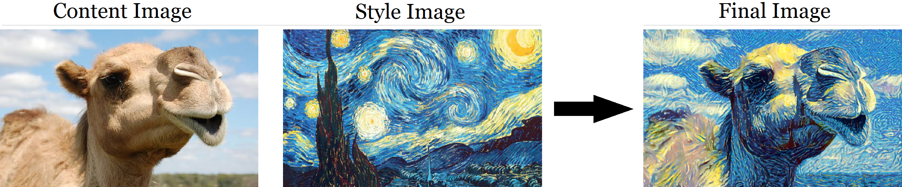
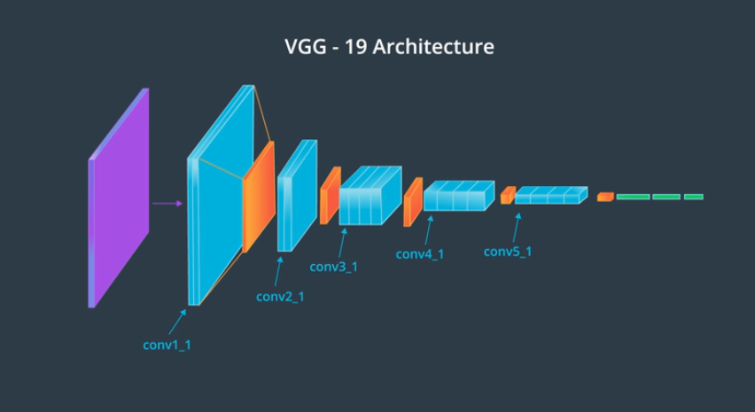
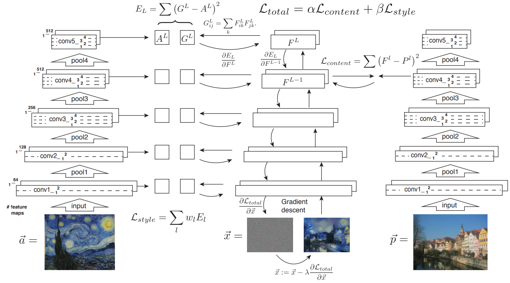
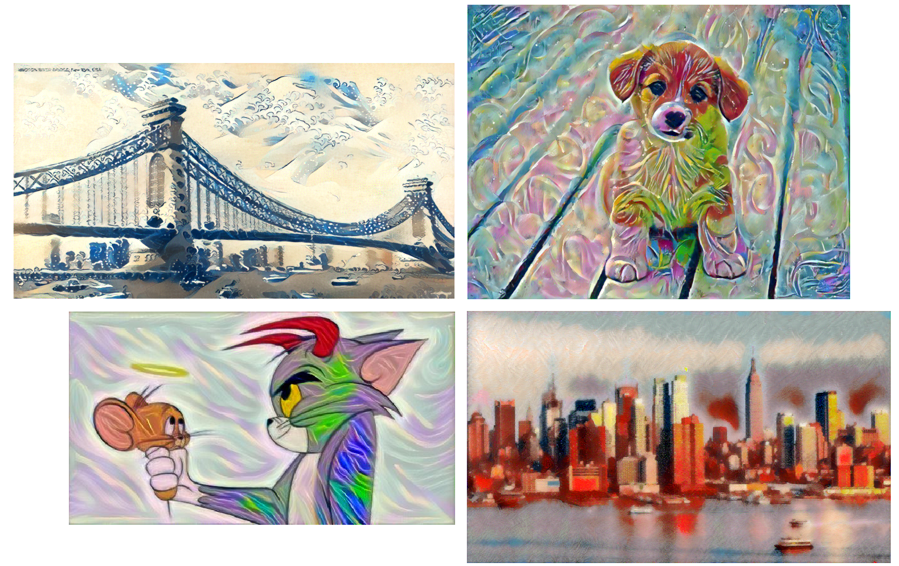

# Neural-Style-Transfer
A PyTorch implementation of the paper [Image Style Transfer Using Convolutional Neural Network by LA Gatys et al. - CVPR 2016.](https://www.cv-foundation.org/openaccess/content_cvpr_2016/papers/Gatys_Image_Style_Transfer_CVPR_2016_paper.pdf)

<p align='center'>

</p>

## How to run

1. Install all dependencies
    ```
    pip install -r requirements.txt
    ```
2. To Run
    ```
    python main.py --content_img <content_image_path> --style_img <style_image_path>
    ```
3. To check for other arguments, run
    ```
    python main.py -h
    ```

## Model Description

1. ***Style*** features are extracted using the `conv1_1`, `conv2_1`, `conv3_1`, `conv4_1`, `conv5_1` layers and ***content*** features from `conv4_2` layer of vgg19 net.
Here I have used pretrained vgg19 net.

<p align='center'>

</p>

2. ***Algorithm*** of style transfer as proposed by the authors.
<p align='center'>

</p>

3. `α` (`alpha`) is `content weight` and `β` (`beta`) is `style weight`. Often the β is kept much larger than α, but sometimes it depends on the style image, and how much the style is to be superimposed with content.

## Artistic results generated using Above model
<p align='center'>

</p>
